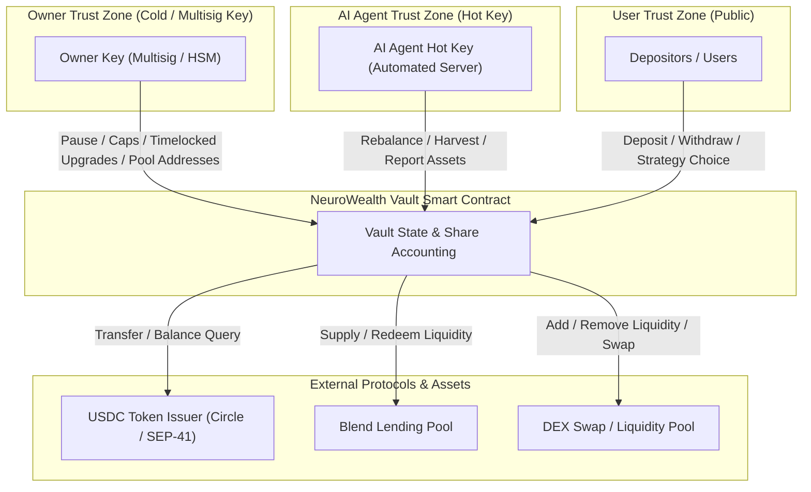

# Security Model

This document describes the security architecture, trust model, and threat model for the NeuroWealth Vault contract.

## Threat Model & Trust Boundaries (Issue #563)

The `NeuroWealthVault` smart contract operates in a multi-actor ecosystem involving privileged governance keys, automated off-chain execution services, end users, external DeFi protocols, and token issuers. System security depends on defining explicit trust boundaries and technical constraints around each actor.

### Trust Boundary Architecture Diagram



### Detailed Trust Boundary Analysis (CAN vs. CANNOT)

#### 1. Owner Key (Cold / Multisig)
The Owner key is the primary administrative authority of the contract. As mandated in [`docs/MAINNET_CHECKLIST.md`](docs/MAINNET_CHECKLIST.md) (Section 1), the Owner key MUST be stored in an offline/multisig cold environment separate from the AI Agent key.

- **CAN**:
  - Emergency pause and unpause the vault (`pause`, `emergency_pause`, `unpause`).
  - Configure deposit safety caps (`set_caps`, `set_tvl_cap`, `set_user_deposit_cap`, `set_deposit_limits`).
  - Set rebalance cooldowns and approval TTLs (`set_rebalance_cooldown`, `set_approval_ttl`).
  - Initiate and execute timelocked AI agent rotations (`update_agent`, `confirm_agent_update`, `cancel_agent_update`).
  - Schedule, execute, or cancel contract WASM upgrades behind a 24-hour timelock (`schedule_upgrade`, `execute_upgrade`, `cancel_upgrade`).
  - Configure whitelisted external protocol pool addresses (`set_blend_pool`, `set_dex_pool`).
  - Initiate and complete ownership transfers (`transfer_ownership`, `accept_ownership`).
  - Execute emergency yield harvests during agent rotation (`emergency_harvest`).
- **CANNOT**:
  - Direct user USDC deposits to owner-controlled arbitrary wallets.
  - Withdraw or burn user shares without explicit user authorization.
  - Modify individual user share balances.
  - Bypass upgrade or agent rotation timelocks (must wait 17,280 ledgers ≈ 24 hours).
  - Perform instant WASM code replacements.

#### 2. AI Agent Hot Key
The AI Agent key is utilized by automated backend trading engines to execute strategy rebalances and update yield metrics. Because it operates in a hot server environment, it faces higher risk of exposure.

- **CAN**:
  - Trigger protocol allocation adjustments between whitelisted strategies (`rebalance`).
  - Execute routine yield compounding (`harvest`).
  - Report total asset valuations and strategy yield/losses (`update_total_assets`).
- **CANNOT**:
  - Transfer vault funds to external addresses outside whitelisted protocol pools.
  - Change vault administrative configurations (caps, pool targets, timelocks, owners).
  - Bypass solvency verification during asset updates (cannot inflate total assets beyond actual balance + pool holdings).
  - Report losses exceeding the per-call decrease cap (capped at `max_decrease_bps`, default 10%).
  - Pause or unpause the contract.
  - Modify user strategy choices or user balances directly.

#### 3. Depositors / Regular Users
Depositors are un-privileged external accounts interacting with the vault to earn yield.

- **CAN**:
  - Deposit USDC into the vault to mint proportional shares (`deposit`, `batch_deposit`).
  - Redeem vault shares for underlying USDC at any time (`withdraw`, `withdraw_all`).
  - Select individual yield strategy preferences (`set_user_strategy`).
  - Call permissionless maintenance utilities (`touch_user_ttl`).
- **CANNOT**:
  - Withdraw funds belonging to other depositors.
  - Trigger vault rebalances or alter asset accounting.
  - Modify vault caps or administrative settings.
  - Inflate share exchange rates (defeated by storage-based asset accounting & minimum deposit floors).

#### 4. Blend Protocol Pool Contract
External lending pool integration.

- **CAN**:
  - Receive supplied USDC from the vault.
  - Generate interest on deployed USDC positions.
  - Return liquidity upon vault redemption requests.
  - Report current pool utilization and liquidity availability.
- **CANNOT**:
  - Mutate `NeuroWealthVault` contract storage or state.
  - Seize idle USDC held in the vault contract.
  - Force liquidations or alter share accounting inside the vault.

#### 5. DEX Protocol Pool Contract
External Automated Market Maker (AMM) pool integration.

- **CAN**:
  - Execute token swaps during strategy shifts.
  - Receive and return liquidity pool tokens.
- **CANNOT**:
  - Access vault funds outside explicit allowance approvals.
  - Mutate vault contract state or storage.

#### 6. USDC Token Issuer (Circle / Stellar Admin)
The asset issuer controlling the underlying USDC token contract on Stellar.

- **CAN**:
  - Issue, mint, or burn global USDC tokens.
  - Freeze or clawback token balances on flagged Stellar accounts (Stellar Asset Control flags).
- **CANNOT**:
  - Access or alter internal vault share accounting (`DataKey::Shares`, `DataKey::TotalShares`).
  - Bypass contract authorization rules.

---

### Mapping External Call Sites to Trust Assumptions

Every external contract call in [`neurowealth-vault/contracts/vault/src/lib.rs`](neurowealth-vault/contracts/vault/src/lib.rs) relies on specific trust assumptions and implements technical mitigations:

| External Call Site | Target Contract | Trust Assumption | Security Mitigation |
|-------------------|-----------------|------------------|---------------------|
| `token_client.transfer` (`deposit`, `withdraw`, `batch_deposit`, `withdraw_all`) | USDC Token Contract | Assumes token contract conforms strictly to Soroban Token Standard (SEP-41) and transfers requested amount accurately without unexpected side-effects. | All storage state updates execute **before** external `transfer` calls (Checks-Effects-Interactions pattern enforced by Issue #568 and `check-stale-state-audit.sh`). |
| `token_client.balance` (`withdraw`, `update_total_assets`, `rebalance`) | USDC Token Contract | Assumes token balance queries return non-manipulated, accurate token counts held by vault. | Balance queries are used as upper-bound solvency checks; direct token transfers into vault cannot inflate share price (storage-based accounting). |
| `BlendPoolClient::submit_with_allowance` & `withdraw` (`supply_to_blend`, `withdraw_from_blend`) | Whitelisted Blend Pool | Assumes Blend pool honors liquidity deposit/withdrawal calls and accurately computes interest. | Blend pool address is restricted to `DataKey::BlendPool` whitelisted strictly by the Owner. Partial withdrawal logic prevents vault lockup during high pool utilization. |
| `BlendPoolClient::get_balance` (`update_total_assets`, `get_protocol_balance`) | Whitelisted Blend Pool | Assumes Blend pool accurately reports deployed balance. | Deployed balance is queried solely for solvency validation; loss updates are bounded by owner co-signatures and per-call decrease caps (max 10%). |
| `DexPoolClient::add_liquidity` & `remove_liquidity` (`supply_to_dex`, `withdraw_from_dex`) | Whitelisted DEX Pool | Assumes AMM pool processes liquidity additions/withdrawals cleanly without excessive slippage. | DEX pool target is restricted to `DataKey::DexPool` set by Owner. Strategy-switch fallback returns funds to idle if DEX pool liquidity is insufficient. |
| `DexPoolClient::get_balance` (`update_total_assets`, `get_protocol_balance`) | Whitelisted DEX Pool | Assumes DEX pool correctly reports vault LP position value. | Solvency validation guardrail; updates are rate-limited and loss-capped. |

---

### Mainnet Checklist Alignment & Verification

This threat model has been formally reviewed against [`docs/MAINNET_CHECKLIST.md`](docs/MAINNET_CHECKLIST.md):

- **Section 1 Compliance (Key Management & Separation)**:
  - Confirms complete independence of Owner ($G_{owner}$) and Agent ($G_{agent}$) keypairs.
  - Strictly isolates the Hot Agent Key (capable only of `rebalance`/`harvest`/`update_total_assets`) from the Cold Owner Key (capable of administrative governance and code upgrades).
- **Section 7 Compliance (Upgrade & Governance Multisig Plan)**:
  - Enforces mandatory 24-hour timelock (`UPGRADE_TIMELOCK_LEDGERS = 17_280`) for all contract code upgrades (`schedule_upgrade` $\rightarrow$ `execute_upgrade`).
  - Provides a cancellation window (`cancel_upgrade`) allowing security monitoring to block malicious or mistaken upgrades during the 24-hour window.
  - Recommends Stellar Multisig or hardware cold storage for the Owner key on mainnet deployments.

## Withdrawal Guarantees

### Automated Liquidity Management

The vault automatically manages liquidity between idle USDC (held in the contract) and deployed assets (e.g., in Blend protocol):
1. **Idle Withdrawals**: If the vault holds sufficient idle USDC, withdrawals are processed immediately.
2. **Protocol Withdrawals**: If idle USDC is insufficient, the vault automatically attempts to withdraw the required amount from the active protocol (e.g., Blend).
3. **Partial Withdrawals**: If the protocol has insufficient liquidity (e.g., high utilization), the user receives all available USDC and **retains their remaining shares** in the vault. This ensures users are not forced into unfavorable liquidations during protocol-wide liquidity crunches.

### Withdrawal Priority

Users can withdraw their USDC at any time without:
- Lock-up periods
- Withdrawal fees
- Approval requirements beyond their signature

## Risk Analysis

### 1. External Protocol Risk (Blend & DEX)

The vault can route idle USDC into external protocols (`get_current_protocol` reports `idle`, `blend`, or `dex`). Each integration introduces systemic risk:
- **Liquidity Risk (Blend)**: If Blend utilization is 100%, the vault cannot pull funds immediately. Users will experience partial withdrawals until liquidity returns to the protocol.
- **Slippage & Liquidity Risk (DEX)**: When the active strategy is a DEX pool, withdrawals and strategy switches execute swaps. Thin pool liquidity can cause slippage or a failed switch; the low-liquidity strategy-switch path returns funds to idle rather than forcing an unfavorable swap.
- **Protocol Failure**: A bug or exploit in Blend or the DEX could result in loss of deployed assets.

### 2. Asset Reporting Risk

The `update_total_assets` function used by the AI agent has built-in guardrails:
- **Solvency Check**: The agent cannot inflate total assets beyond the combined balance of idle USDC and funds actually deployed to external protocols.
- **Decrease Bounding**: Reporting a loss is capped (default 10% per call) to prevent sudden, massive devaluations from a single malicious or erroneous call.

### 3. Agent Rebalance Risk

The AI agent can move funds between protocols via `rebalance()`, but is constrained:
- **Rebalance Cooldown**: Consecutive rebalances are rate-limited by a configurable cooldown (`get_rebalance_cooldown` / `get_last_rebalance_ledger`), which bounds how quickly a compromised or malfunctioning agent can churn funds across protocols.
- **No Direct Custody**: Rebalancing only moves funds between the vault's own positions in whitelisted pools; the agent cannot redirect funds to an arbitrary address.

### 4. Upgrade Risks

The contract owner can upgrade the contract code. To protect against malicious or accidental instant code changes, upgrade risk is mitigated via a mandatory two-step timelock mechanism:
- **Two-Step Timelock**: Upgrades must first be scheduled via `schedule_upgrade(new_wasm_hash)`, initiating a timelock delay before `execute_upgrade()` can be called.
- **Cancellation Window**: During the timelock window, the owner or security monitoring can invoke `cancel_upgrade()` to abort a compromised or erroneous upgrade proposal.
- **Owner Multi-Sig Recommended**: For mainnet deployment, owner authority should be held by a multi-sig account.

### 5. State Rent & TTL Expiry

Soroban persistent entries (such as each user's `Shares` record) accrue state rent and expire if their TTL is not periodically extended:
- **Pure Read-Only Getters**: `get_balance` and `get_shares` are side-effect free — they do **not** extend storage TTL. This keeps pure reads cheap and prevents read traffic from silently mutating ledger state.
- **Explicit Maintenance**: Off-chain indexers or maintenance jobs should call the permissionless `touch_user_ttl(user)` to refresh a user's `Shares` TTL. State-changing calls (`deposit`, `withdraw`) already rewrite `Shares` and refresh its TTL during normal operation.
- **Risk**: A long-dormant user who never transacts and whose entry is never touched could see their `Shares` entry expire and require restoration. Active users, and any indexer running `touch_user_ttl`, are unaffected.

## Access Control Summary

| Function | Owner | Agent | User | Anyone |
|----------|-------|-------|------|--------|
| update_agent | yes | - | - | - |
| confirm_agent_update | yes | - | - | - |
| cancel_agent_update | yes | - | - | - |
| update_total_assets | - | yes | - | - |
| deposit | - | - | yes | - |
| withdraw | - | - | yes | - |
| withdraw_all | - | - | yes | - |
| rebalance | - | yes | - | - |
| harvest | - | yes | - | - |
| pause | yes | - | - | - |
| emergency_pause | yes | - | - | - |
| unpause | yes | - | - | - |
| set_caps | yes | - | - | - |
| set_tvl_cap | yes | - | - | - |
| set_user_deposit_cap | yes | - | - | - |
| set_deposit_limits | yes | - | - | - |
| set_limits | yes | - | - | - |
| set_rebalance_cooldown | yes | - | - | - |
| set_approval_ttl | yes | - | - | - |
| set_blend_approval_ttl | yes | - | - | - |
| schedule_upgrade | yes | - | - | - |
| execute_upgrade | yes | - | - | - |
| cancel_upgrade | yes | - | - | - |
| set_blend_pool | yes | - | - | - |
| set_dex_pool | yes | - | - | - |
| transfer_ownership | yes | - | - | - |
| cancel_ownership_transfer | yes | - | - | - |
| accept_ownership | - | - | - | pending owner |
| touch_user_ttl | - | - | - | anyone |
| set_user_strategy | - | - | yes | - |

### Emergency Harvest Fallback (Issue #506)

When the agent key is lost, compromised, or mid-rotation via the
`update_agent` timelock, the normal `harvest()` function is unusable because
it requires agent authorization. The owner can call `emergency_harvest(min_out)`
to compound yield during this window:

- **Gating**: Owner auth only (not agent auth)
- **Pause bypass**: Works even when the vault is paused, so the owner can
  compound yield during an emergency pause without unpausing first
- **Same mechanics**: Withdraws accrued yield from the active protocol and
  re-supplies it (same round-trip as `harvest()`)
- **Distinct event**: Emits `EmergencyHarvestEvent` (topic `em_harv`) so
  indexers can differentiate from agent-initiated `HarvestEvent` (topic
  `harvest`)

| Function | Owner | Agent | User | Anyone |
|----------|-------|-------|------|--------|
| emergency_harvest | yes | - | - | - |

## Pause-Semantics Matrix

> **Issue #601** — Definitive table of which functions are blocked vs. allowed
> while the vault is paused. This table is the source of truth; the exhaustive
> test in
> [`neurowealth-vault/contracts/vault/src/tests/test_pause.rs`](neurowealth-vault/contracts/vault/src/tests/test_pause.rs)
> encodes it as parameterised assertions so future functions cannot silently
> bypass pause checks.

### Legend

| Symbol | Meaning |
|--------|---------|
| 🔴 BLOCKED | Function panics with `VaultError::Paused` (#35) when the vault is paused |
| 🟢 ALLOWED | Function executes normally while the vault is paused |

### State-Changing Functions

| Function | Caller | Paused Behaviour | Rationale |
|----------|--------|-----------------|-----------|
| `deposit` | User | 🔴 BLOCKED | No new deposits accepted during an emergency |
| `batch_deposit` | User | 🔴 BLOCKED | Same reason as `deposit` |
| `withdraw` | User | 🔴 BLOCKED | See note below on withdrawal semantics |
| `withdraw_all` | User | 🔴 BLOCKED | See note below on withdrawal semantics |
| `rebalance` | Agent | 🔴 BLOCKED | No fund movement while vault is paused |
| `harvest` | Agent | 🔴 BLOCKED | No protocol interaction while paused |
| `schedule_upgrade` | Owner | 🔴 BLOCKED | Upgrades must not be proposed during an emergency |
| `execute_upgrade` | Owner | 🔴 BLOCKED | Execution of a pending upgrade requires unpaused vault |
| `cancel_upgrade` | Owner | 🟢 ALLOWED | Cancelling a malicious upgrade must be possible even while paused |
| `update_total_assets` | Agent + Owner | 🟢 ALLOWED | Yield/loss reporting should remain available for bookkeeping |
| `emergency_harvest` | Owner | 🟢 ALLOWED | Owner fallback for compounding yield during an agent-key rotation; explicitly bypasses pause |
| `pause` | Owner | 🟢 ALLOWED | Must be callable to transition into the paused state |
| `unpause` | Owner | 🟢 ALLOWED | Must be callable to resume normal operations |
| `emergency_pause` | Owner | 🟢 ALLOWED | Must be callable even when already paused (idempotent) |
| `update_agent` | Owner | 🟢 ALLOWED | Agent rotation is a recovery action; blocking it during a pause would worsen an incident |
| `confirm_agent_update` | Owner | 🟢 ALLOWED | Completing agent rotation must not be blocked |
| `cancel_agent_update` | Owner | 🟢 ALLOWED | Cancelling a malicious agent update must always be possible |
| `transfer_ownership` | Owner | 🟢 ALLOWED | Ownership rotation is a recovery action |
| `accept_ownership` | Pending owner | 🟢 ALLOWED | Completing ownership transfer must not be blocked |
| `cancel_ownership_transfer` | Owner | 🟢 ALLOWED | Must remain available during emergencies |
| `set_tvl_cap` | Owner | 🟢 ALLOWED | Configuration changes should be possible during a pause |
| `set_user_deposit_cap` | Owner | 🟢 ALLOWED | Configuration changes should be possible during a pause |
| `set_caps` | Owner | 🟢 ALLOWED | Configuration changes should be possible during a pause |
| `set_deposit_limits` | Owner | 🟢 ALLOWED | Configuration changes should be possible during a pause |
| `set_limits` (deprecated) | Owner | 🟢 ALLOWED | Same as `set_caps` |
| `set_blend_pool` | Owner | 🟢 ALLOWED | Pool reconfiguration is a recovery action |
| `set_dex_pool` | Owner | 🟢 ALLOWED | Pool reconfiguration is a recovery action |
| `set_rebalance_cooldown` | Owner | 🟢 ALLOWED | Configuration changes should be possible during a pause |
| `set_approval_ttl` | Owner | 🟢 ALLOWED | Configuration changes should be possible during a pause |
| `set_blend_approval_ttl` | Owner | 🟢 ALLOWED | Configuration changes should be possible during a pause |
| `set_max_consecutive_failures` | Owner | 🟢 ALLOWED | Configuration changes should be possible during a pause |
| `set_user_strategy` | User | 🟢 ALLOWED | Preference storage; no fund movement |
| `touch_user_ttl` | Anyone | 🟢 ALLOWED | Permissionless TTL maintenance; no fund movement |
| `initialize` | Deployer | 🟢 ALLOWED | Initialization runs before pause is even possible |

### Read-Only / View Functions

All view/getter functions are 🟢 **ALLOWED** while paused. They perform no
state changes and emit no events. Blocking them during a pause would prevent
operators from assessing vault state.

| Function | Paused Behaviour |
|----------|-----------------|
| `is_paused` | 🟢 ALLOWED |
| `get_balance` | 🟢 ALLOWED |
| `get_total_deposits` | 🟢 ALLOWED |
| `get_total_assets` | 🟢 ALLOWED |
| `get_total_shares` | 🟢 ALLOWED |
| `get_shares` | 🟢 ALLOWED |
| `get_users_with_shares` | 🟢 ALLOWED |
| `get_user_info` | 🟢 ALLOWED |
| `get_owner` | 🟢 ALLOWED |
| `get_agent` | 🟢 ALLOWED |
| `get_version` | 🟢 ALLOWED |
| `get_usdc_token` | 🟢 ALLOWED |
| `get_current_protocol` | 🟢 ALLOWED |
| `get_blend_pool` | 🟢 ALLOWED |
| `get_dex_pool` | 🟢 ALLOWED |
| `get_tvl_cap` | 🟢 ALLOWED |
| `get_user_deposit_cap` | 🟢 ALLOWED |
| `get_min_deposit` | 🟢 ALLOWED |
| `get_max_deposit` | 🟢 ALLOWED |
| `get_idle_balance` | 🟢 ALLOWED |
| `get_deployed_assets` | 🟢 ALLOWED |
| `get_asset_breakdown` | 🟢 ALLOWED |
| `get_exchange_rate` | 🟢 ALLOWED |
| `get_rebalance_cooldown` | 🟢 ALLOWED |
| `get_last_rebalance_ledger` | 🟢 ALLOWED |
| `get_approval_ttl` | 🟢 ALLOWED |
| `get_blend_approval_ttl` | 🟢 ALLOWED |
| `get_max_consecutive_failures` | 🟢 ALLOWED |
| `get_consecutive_failures` | 🟢 ALLOWED |
| `get_pending_upgrade` | 🟢 ALLOWED |
| `get_pending_agent_update` | 🟢 ALLOWED |
| `get_pending_owner` | 🟢 ALLOWED |
| `get_pending_ownership` | 🟢 ALLOWED |
| `get_user_strategy` | 🟢 ALLOWED |
| `preview_deposit_to_shares` | 🟢 ALLOWED |
| `preview_shares_to_assets` | 🟢 ALLOWED |
| `preview_withdraw` | 🟢 ALLOWED |
| `convert_to_shares` | 🟢 ALLOWED |
| `convert_to_assets` | 🟢 ALLOWED |

### Note on Withdrawal Semantics

Both `withdraw` and `withdraw_all` are **blocked** while the vault is paused.
This is a deliberate design choice:

- The pause mechanism is an **emergency stop** intended to freeze all fund
  movement while a security incident is investigated.
- Allowing withdrawals while paused could enable a race between an attacker
  (draining funds) and the security team (trying to stop the drain).
- The owner-compromise runbook documents how to unpause safely once the
  incident is resolved, at which point normal withdrawals resume immediately.

If a future version of the protocol wishes to allow emergency withdrawals
while paused, this would require a separate "withdrawal-allowed" flag that is
independent of the pause flag, along with careful analysis of reentrancy and
ordering risks.

### Checklist for Adding New Functions

When adding a new contract function, the author **must** update this matrix and
the corresponding test in `test_pause.rs`. The PR review checklist
(`.github/pull_request_template.md`) includes a pause-semantics item for this
purpose.

## Security Best Practices Implemented

1. **Checks-Effects-Interactions Pattern**: All state updates happen before external calls
2. **Auth on Withdrawals**: `require_auth()` ensures users can only access their own funds
3. **Minimum Deposits**: Prevents dust attacks
4. **Deposit Caps**: Limits exposure per user
5. **TVL Caps**: Limits total exposure
6. **Pausable**: Emergency stop functionality

## Owner-Compromise Response Runbook

If the owner keypair is suspected or confirmed to be compromised, follow this
sequence immediately. Every step that requires owner auth is marked **[owner]**.

For agent-key compromise procedures, see the [Agent-Key Compromise Runbook](docs/AGENT_KEY_COMPROMISE_RUNBOOK.md).

### Step 1 — Pause the vault (within minutes)

The single fastest action to protect user funds is an emergency pause. No new
deposits or withdrawals can execute while the vault is paused.

```bash
stellar contract invoke \
  --id $VAULT_CONTRACT_ID \
  --source <OWNER_SECRET_KEY> \
  --network mainnet \
  -- pause
```

**Requires**: owner auth **[owner]**

> **Note:** Unlike `pause`, the `emergency_pause` function also requires owner
> auth. If the owner key is already confirmed compromised and you cannot sign
> with it, see Step 2 to assess whether the attacker has already rotated
> the owner address.

### Step 2 — Assess exposure

Before taking further action, determine what the attacker could have done or
is still doing:

| Check | Command |
|---|---|
| Current paused state | `stellar contract invoke --id $VAULT_CONTRACT_ID --network mainnet -- get_paused` |
| Current owner address | `stellar contract invoke --id $VAULT_CONTRACT_ID --network mainnet -- get_owner` |
| Current agent address | `stellar contract invoke --id $VAULT_CONTRACT_ID --network mainnet -- get_agent` |
| Pending agent update | `stellar contract invoke --id $VAULT_CONTRACT_ID --network mainnet -- get_pending_agent_update` |
| Pending contract upgrade | `stellar contract invoke --id $VAULT_CONTRACT_ID --network mainnet -- get_pending_upgrade` |
| Active protocol (idle/blend/dex) | `stellar contract invoke --id $VAULT_CONTRACT_ID --network mainnet -- get_current_protocol` |
| TVL cap | `stellar contract invoke --id $VAULT_CONTRACT_ID --network mainnet -- get_tvl_cap` |

Owner-only actions an attacker with the key could have taken:
- Initiated `update_agent` or `schedule_upgrade` to queue a malicious agent or WASM upgrade.
- Called `set_blend_pool` or `set_dex_pool` to point the vault at a drain contract.
- Called `set_caps` to raise or remove deposit limits.
- Initiated `transfer_ownership` to a new address they control.

**The attacker cannot directly withdraw user funds** — withdrawals require
the *user's* own auth signature, not the owner key.

### Step 3 — Rotate the owner key

Generate a new owner keypair on an air-gapped machine. Then initiate the
two-step ownership transfer from the current (compromised) key while you still
control it:

```bash
# Step 3a — propose new owner [owner]
stellar contract invoke \
  --id $VAULT_CONTRACT_ID \
  --source <CURRENT_OWNER_SECRET_KEY> \
  --network mainnet \
  -- transfer_ownership \
  --new_owner <NEW_OWNER_ADDRESS>

# Step 3b — accept from the new keypair [pending owner]
stellar contract invoke \
  --id $VAULT_CONTRACT_ID \
  --source <NEW_OWNER_SECRET_KEY> \
  --network mainnet \
  -- accept_ownership
```

If the compromised key has already been used to initiate an attacker-controlled
`transfer_ownership`, the pending owner is stored under `DataKey::PendingOwner`.
You must call `accept_ownership` from the *legitimate* new owner before the
attacker does. Check `DataKey::PendingOwner` on-chain immediately.

### Step 4 — Revert any attacker configuration changes & pending timelocks

Once the new owner key is in place, audit and reset all owner-controlled state and cancel pending malicious timelocks:

```bash
# Cancel any pending malicious agent update or contract upgrade scheduled by attacker [owner]
stellar contract invoke --id $VAULT_CONTRACT_ID --source <NEW_OWNER_KEY> \
  --network mainnet -- cancel_agent_update

stellar contract invoke --id $VAULT_CONTRACT_ID --source <NEW_OWNER_KEY> \
  --network mainnet -- cancel_upgrade

# Initiate and confirm agent update to legitimate AI agent address via timelock [owner]
stellar contract invoke --id $VAULT_CONTRACT_ID --source <NEW_OWNER_KEY> \
  --network mainnet -- update_agent --new_agent <LEGITIMATE_AGENT_ADDRESS>

# (After timelock window expires)
stellar contract invoke --id $VAULT_CONTRACT_ID --source <NEW_OWNER_KEY> \
  --network mainnet -- confirm_agent_update

# Reset pool addresses to audited contracts [owner]
stellar contract invoke --id $VAULT_CONTRACT_ID --source <NEW_OWNER_KEY> \
  --network mainnet -- set_blend_pool --pool_address <AUDITED_BLEND_POOL>

stellar contract invoke --id $VAULT_CONTRACT_ID --source <NEW_OWNER_KEY> \
  --network mainnet -- set_dex_pool --pool_address <AUDITED_DEX_POOL>

# Restore caps to pre-incident values [owner]
stellar contract invoke --id $VAULT_CONTRACT_ID --source <NEW_OWNER_KEY> \
  --network mainnet -- set_caps \
  --user_deposit_cap <ORIGINAL_CAP> --tvl_cap <ORIGINAL_TVL_CAP>
```

### Step 5 — Restore safe operation

Only unpause once Steps 1–4 are fully complete and verified.

```bash
stellar contract invoke \
  --id $VAULT_CONTRACT_ID \
  --source <NEW_OWNER_SECRET_KEY> \
  --network mainnet \
  -- unpause
```

**Requires**: owner auth **[owner]**

### Step 5a — Emergency harvest during agent-key rotation

If the vault has funds deployed to a protocol (Blend or DEX) and the agent
key is being rotated, use `emergency_harvest` to compound yield without
waiting for the new agent key:

```bash
stellar contract invoke \
  --id $VAULT_CONTRACT_ID \
  --source <NEW_OWNER_SECRET_KEY> \
  --network mainnet \
  -- emergency_harvest \
  --min_out 0
```

**Requires**: owner auth **[owner]**

> **Note:** `emergency_harvest` bypasses the paused-state check, so it can be
> called before or after `unpause`. It still respects the rebalance cooldown
> and requires an active protocol (panics with `UnsupportedProtocol`
> if `CurrentProtocol == "none"`). The emitted `EmergencyHarvestEvent` (topic
> `em_harv`) is distinct from the regular `HarvestEvent` (topic `harvest`).
>
> Resume normal agent-initiated `harvest()` calls once the new agent key is
> confirmed.

### Step 6 — Post-incident

- Revoke and rotate all credentials that were co-located with the compromised key.
- Publish a post-mortem within 72 hours.
- Consider migrating to a multi-sig owner address before resuming normal operations.

---

## Audit & Mainnet Deployment Checklist

Before any mainnet deployment, you must refer to and complete the formal [Mainnet Deployment Checklist](docs/MAINNET_CHECKLIST.md).

Additionally, ensure:

- [ ] All functions have documented panic conditions
- [ ] All state changes emit events
- [ ] Access control verified for each function
- [ ] Upgrade mechanism tested on testnet
- [ ] Pause/unpause tested
- [ ] Withdrawal flow tested with edge cases
- [ ] Maximum deposit limits enforced
- [ ] TVL cap enforced
- [ ] Integration with USDC token tested
- [ ] Integration with Blend protocol tested (Phase 2)
